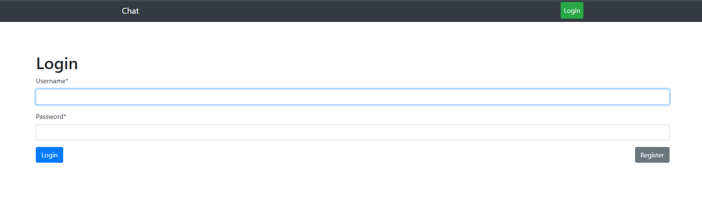
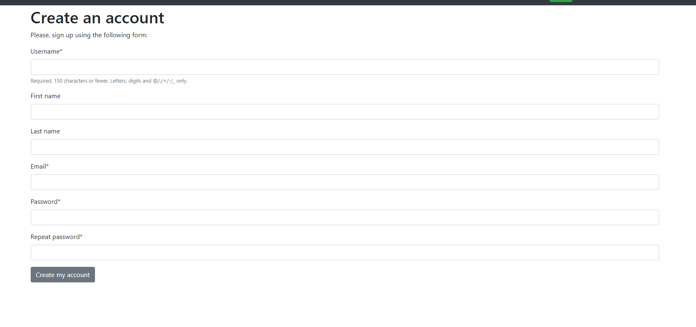
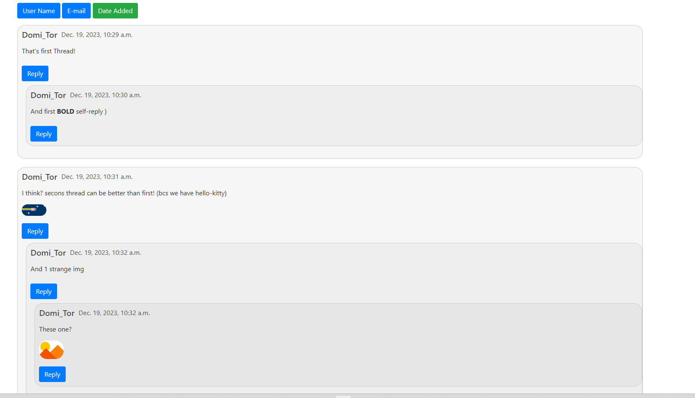
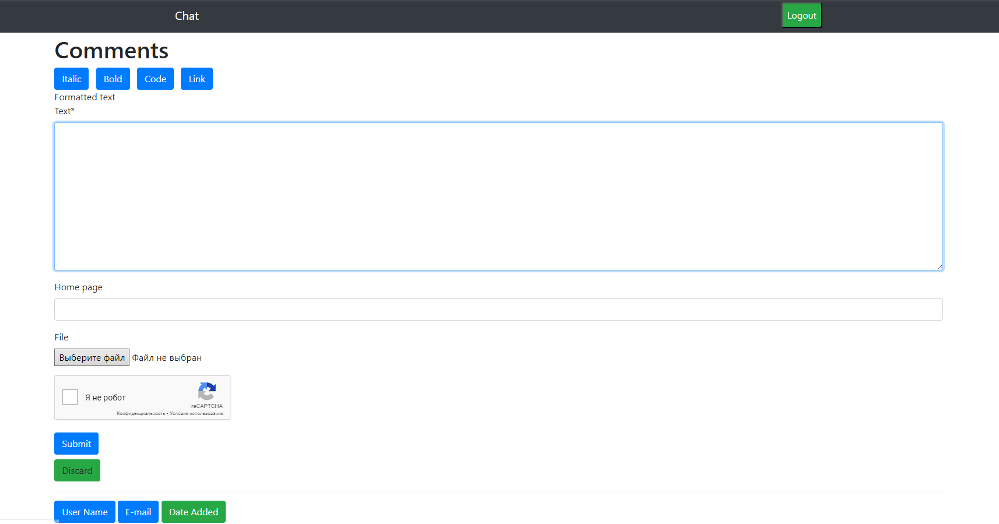

# SPA-chat

SPA application for writing threads and lively discussions

# Windows/MacOS install

1. If you are using PyCharm - it may propose you to automatically create venv for your project 
    and install requirements in it, but if not:

    `python -m venv venv`

    `venv\Scripts\activate` (on Windows)

    `source venv/bin/activate` (on macOS)

    `pip install -r requirements.txt`
2. Then use following commands:

    `python manage.py makemigrations`

    `python manage.py migrate`
3. Configure .env flie
   
4. Use following command:

   `python manage.py runserver`

# Docker install
    
    docker pull cactus717/django-chat

    docker run -p 8000:8000 cactus717/django-chat

# Features
* Authentication functionality
* Pagination by 25 threads
* Sorting by `username`, `email`, `created date`
* Captcha
* Ability to formatting text in form (with `a`, `i`, `code`, `strong` tags)
* Overview message before send
* Threads system (start your own thread or reply other comments)

Then go to http://localhost:8000

# Demo

## Login

## Register

## Threads(main)

## Reply form

